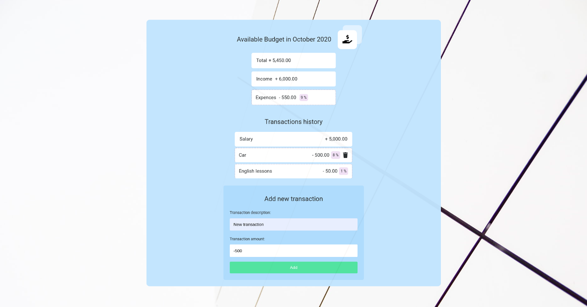
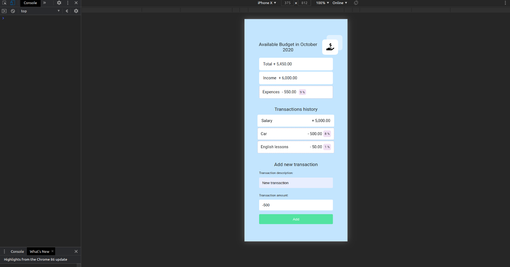

## Budget App 

### Demo

https://hopeful-babbage-1f72b7.netlify.app/

#### Screenshots of the app

### Technologies

- JavaScript
- Sass
- Webpack

## Getting started

  App requires to have node (4.x.x) and npm (2.x.x) installed.

#### Start with installing the dependencies:

  Run `npm install` to install all required packages.

#### Running:

  Use `npm run dev` to start the dev server.

