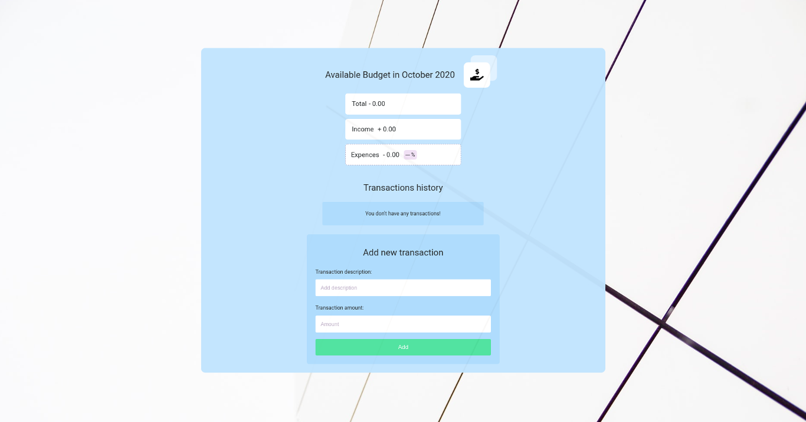

## Budget App 

Native JavaScript application.

## Description

A web application created by JavaScript. The project is designed to demonstrate practical knowledge and skills about native JavaScript, DOM API and setting up the Webpack  module bundler.

### Demo

https://hopeful-babbage-1f72b7.netlify.app/

#### Screenshots of the app

### Technologies

- JavaScript
- Sass
- Webpack

### Features 

- Adding/Removing transaction (validation of description and transaction value)
- Displaying a list of transactions, total amount of all transactions, income transactions and expense transactions
- Calculating the total amount of all transactions, income transactions and expense transactions
- Displaying of the total percentage of expense transactions from the total amount of transactions

## Getting started

  App requires to have node (4.x.x) and npm (2.x.x) installed.

#### Start with installing the dependencies:

  Run `npm install` to install all required packages.

#### Running:

  Use `npm run dev` to start the dev server.
